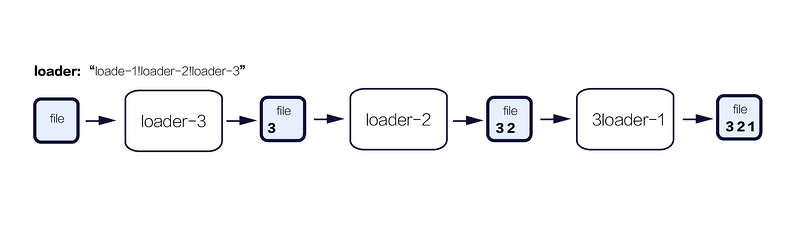

> 以webpack4为例进行学习

## 核心概念

- 入口(entry)
- 输出(output)
- loader
- 插件(plugins)

### 入口(entry)
> 起始模块文件，其内部的所有直接依赖和间接依赖，全部会被webpack获取并串联起来

```js
module.exports = {
    entry: {
        index: './src/index.js',
        home: './src/home.js'
    }
}
```

### 输出(output)
> 配置输出文件的位置（绝对路径）和文件的命名规则等

```js
const path = require('path')

module.exports = {
    ...
    output: {
        path: path.resolve(__dirname, 'dist'),
        filename: '[name].[chunkhash].js',
        publicPath: './assets/' // 资源加载路径，可不配置
    }
};
```

### loader
> webpack只能理解javascript，这样就需要loader将那些非js文件处理成有效的模块，当然也能使用loader处理过程中的source，只要最后能保证输出的是有效模块即可


**固定搭配**
- test：正则匹配出对应的目标文件
- use：对匹配出的文件使用相应的loader处理

```js
module.exports = {
    ...
    module: {
        rules: [{
            test: /\.css$/,
            use: [{
                loader: 'css-loader',
                options: {
                    ...
                }
            }]
        }]
    }
}
```

**PS**: 在同一种类型的源文件上，可以同时执行多个 loader，loader 的执行方式可以类似管道的方式，管道执行的方向为从右到左



### 插件(plugins)
> 比loader更强，处理更广泛的任务，比如：压缩文件/图片，用模板生成html，提取某类型内容成为单独文件等

```js
const path = require('path')
const HtmlWebpackPlugin = require('html-webpack-plugin')
const webpack = require('webpack') // 用于访问内置插件
const ExtractTextPlugin = require('extract-text-webpack-plugin')
const CleanPlugin = require('clean-webpack-plugin')

// Create multiple instances
const extractCSS = new ExtractTextPlugin('[name].[chunkhash].css')

module.exports = {
    ...
    module: {
        rules: [{
            test: /\.css$/,
            include: path.resolve(__dirname, 'src'),
            use: extractCSS.extract({
                use: [{
                    loader: 'css-loader',
                }]
            })
        }]
    }
    plugins: [
        new CleanPlugin(path.resolve(__dirname, 'dist')),
        new webpack.optimize.UglifyJsPlugin(),
        new HtmlWebpackPlugin({template: './src/[name].html'}),
        extractCSS
    ]
}
```

### 模式
> 通过选择 `development` 或 `production` 之中的一个，来设置 mode 参数，你可以启用相应模式下的 webpack 内置的优化

```js
module.exports = {
    mode: 'development'
}
```

### 常用的**loader**
> [官方列举的loaders](https://webpack.docschina.org/loaders/)

### 常用的**plugins**
> [官方列举的plugins](https://webpack.docschina.org/plugins/)

- webpack-bundle-analyzer 可以看到项目各模块的大小，可以按需优化

### webpack4 兼容

- webpack4，不再支持extract-text-webpack-plugin
    - 原因：extract-text-webpack-plugin 最新版本为 3.0.2，这个版本还没有适应 webpack 4 的版本
    - 解决办法：使用 4.0 beta 版，`npm install --save-dev extract-text-webpack-plugin@next`
- webpack4 使用 html-webpack-plugin插件报错
    - 解决方法：`npm install webpack-contrib/html-webpack-plugin -D`

### 参考文章：
- [webpack官方文档](https://webpack.docschina.org/concepts/)
- [编写一个 loader](https://webpack.docschina.org/contribute/writing-a-loader/)
- [webpack容易混淆的部分](https://medium.com/@rajaraodv/webpack-the-confusing-parts-58712f8fcad9)
- [入门Webpack，看这篇就够了](http://www.jianshu.com/p/42e11515c10f)
- [Webpack从入门到上线](http://yincheng.site/webpack)